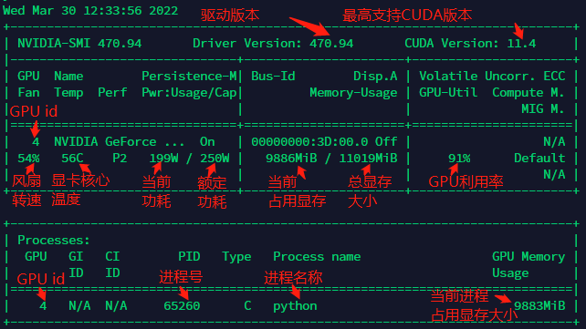

# 记录些linux基础操作命令
## 一、Conda相关
### 1、anaconda自身
1. 查看conda版本
> conda --version

2. 查看目前虚拟环境
> conda env list

### 2、anaconda创建虚拟环境并且启动
1. 创建虚拟环境
> conda create -n env_name python=x.x

2. 激活虚拟环境
> conda activate env_name

3. 查看当前虚拟环境下的依赖
> conda list

## 二、Cuda相关
### 1、显卡信息
1. 瞬时显卡信息
> nvidia-smi

2. 实时更新显卡信息
> watch -n refresh_time nvidia-smi

3. nvidia-smi展示信息解读



## 三、shell相关
## 四、pycharm相关
### 4.1 python运行需要添加参数
```
右上角工具栏 -> edit configurations -> 对应项目 -> parameters
```

### 4.2 断点调试
```
F9: 跳到下一个断点
F8: step over, 运行该语句，不进入函数体
F7: step into, 运行该语句，进入函数体
```