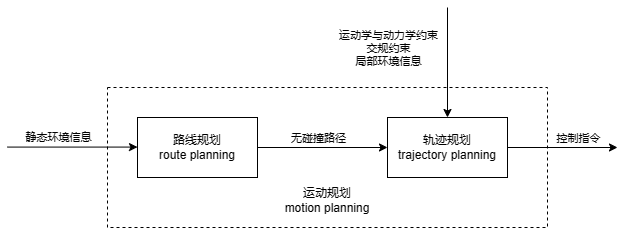

# 运动规划综述（Motion Planning）

## 一、什么是运动规划

运动规划（Motion Planning）指车辆在**一定约束**下从起点到终点的**几何**路径，同时给出车辆沿该路径运动的速度信息。  
运动规划（Motion Planning）以**最优性**为核心，在环境中给定起点和终点的条件下，规划机器人**无冲突行进**的状态序列。运动规划框架如下所示，主要包含路径规划与轨迹规划两大组件。

### 1.1 约束

1. 交通规则
2. 运动学约束

> 不能实现瞬时侧向移动，前驱的车辆必须依赖前轮的转向才能实现变道、转向等操作，在弯道上不能速度过快等等

1. 静态障碍物(Static Obstacle)约束

> 静态障碍物(Static Obstacle)是道路上静止的车辆、路面中间的石墩子等车辆不可行驶的区域（全局规划考虑）

1. 动态障碍物约束

> 实时处理行人、车辆等各种运动的障碍物，避免与障碍物发生碰撞事故 （局部规划考虑）

### 1.2 路径规划（Path Planning）
1. 路径规划以可达性为核心，基于几何约束（如静态障碍物，地图等），规划机器人首末位置间无冲突行进的最优路径（路径长度尽量短）序列。   
2. 这样的最优路径序列，在二维空间表现为可行驶的几何曲线，这样的集合曲线由一系列路径点（waypoints）构成，路径点是空间中的位置或关节角度
3. 路径规划只有几何属性，不考虑时间序列信息，一般用在全局规划

### 1.3 轨迹规划（Trajectory Planning）
1. 轨迹规划以稳定性和快速性为核心，基于运动学、动力学约束和路径序列，规划实时运动状态（位置，朝向，速度以及加速度等）以逼近全局路径。
2. 轨迹规划在路径规划的最优路径序列的基础上，为其加上时间序列信息。所以其输入为全局路径、动态环境和模型约束，通常在局部范围内进行动态避障和路径跟踪。

## 二、传统运动规划

### 2.1 路径规划 && 速度规划
在实际工程应用中，下发的往往是路径而非轨迹，这意味着轨迹规划被分解为路径规划 + 速度规划的两阶段计算架构，即首先生成行驶的几何曲线，随后考虑以何种速度沿着规划的曲线行驶。采用该种方式原因总结如下  
（1）轨迹规划计算过程困难，这种分解方式能大幅度降低求解难度。   
（2）通过规划生成的轨迹，本身就难以在后续控制模块中被有效的跟踪。   
（3）决策规划模块仅需生成路径而非轨迹，车辆实际运动速度暂时无法或无需决策。

## 三、端到端运动规划

 
一般地，路径规划的输入是全局静态环境，也称为全局规划(Global Planning).  
轨迹规划的输入是全局路径、动态环境和模型约束，通常在局部范围内进行动态避障和路径跟踪，也称为局部规划(Local Planning)。

车辆运动规划是指生成衔接车辆起点与终点的几何路径，同时给出车辆沿该路径运动的速度信息，并使车辆在整个运动过程中满足运动学 / 动力学约束、碰撞躲避约束以及其他源自内部系统或外部环境的时间和 / 或空间约束条件。  
路径规划（一般指位置规划）是找到一系列要经过的路径点，路径点是空间中的位置或关节角度，而轨迹规划是赋予路径时间信息。
